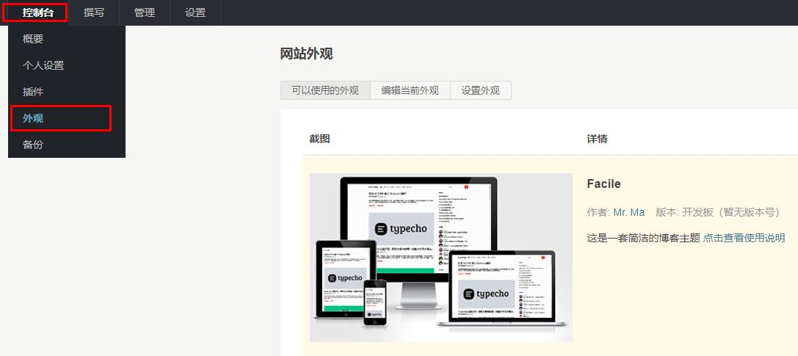

## 下载

访问 [https://github.com/changbin1997/Facile/releases](https://github.com/changbin1997/Facile/releases) 选择最新的 **Facile-bundle.zip** 下载。

## 安装

下载完成后是一个 `.zip` 格式的压缩包，解压后应该能看到一个名为 `Facile` 的文件夹，把这个 `Facile` 文件夹放到你的 Typecho 目录下的 `usr/themes` 目录。

在 `themes` 目录需要保证有一个 `Facile` 文件夹。

登录 Typecho 后台，在顶部导航栏的 `控制台` 菜单选择 `外观` 进入主题选择页，看到 Facile 后点击 `启用` 。



## 克隆项目

如果您有二次开发需求的话，也可以选择克隆项目，克隆命令是：

```bash
https://github.com/changbin1997/Facile.git
```

克隆完成后把 `Facile` 文件夹拷贝到 Typecho 目录下的 `usr/themes` 目录。

主题的 SCSS 文件修改后需要用 [Sass](https://www.misterma.com/archives/713/) 编译为 CSS 才能使用。

前端的 JS 用到了 ES6 语法，需要用 [Babel](https://www.misterma.com/archives/851/) 转换为 ES5 或更低版本才能给 IE 系列浏览器和老版本浏览器使用。
