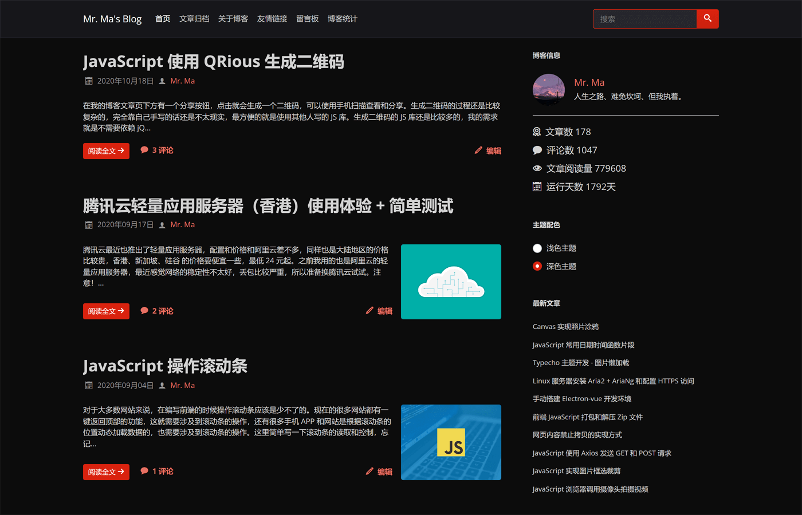
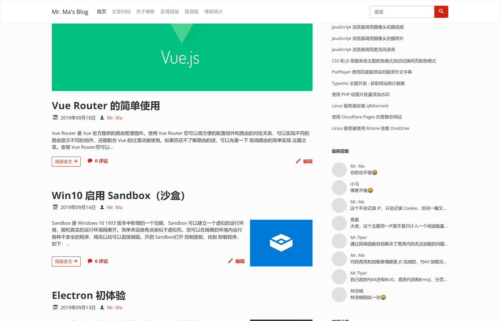

Facile 是一套 Typecho 双栏博客主题，也是 [我的博客](https://www.misterma.com/) 现在使用的主题。

Facile 主题下载地址：[https://github.com/changbin1997/Facile/releases](https://github.com/changbin1997/Facile/releases) 

Facile 主题在线演示地址：[https://www.misterma.com/](https://www.misterma.com/) 

Facile Github 仓库：[https://github.com/changbin1997/Facile](https://github.com/changbin1997/Facile) 

下面是主题首页截图：

Facile 主题也包含深色模式：

文章列表的文章头图可以设置为小图模式：

也可以大图和小图搭配使用：

