## 进入主题设置

登录 Typecho 后台，在顶部导航栏的 `控制台` 菜单选择 `外观` ，进入主题选择页后点击 `设置外观` ，如下图：

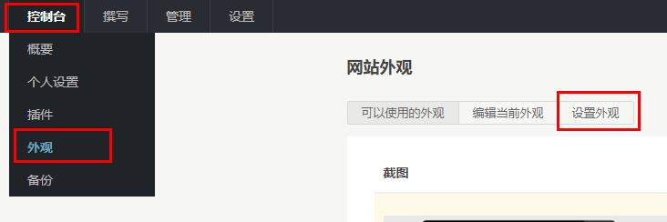

## 外观

### 默认主题配色

默认主题配色可以设置用户访问你的网站时使用的配色，你也可以在侧边栏添加一个配色切换组件来让用户自己选择。

默认主题配色目前支持 `浅色` 、`深色` 、`跟随系统主题` 。

跟随系统主题就是根据用户的系统配色来自动选择浅色或深色，目前 Windows 系统只有较新的 Win10 和 Win11 支持，IE 11 不支持，默认会显示浅色。iOS 只有包含深色模式的版本才支持。

不支持跟随系统主题的用户设备默认会使用浅色配色。

## 站点信息

### 站点 Logo 地址

Logo 是一个 `.ico` 格式的 icon 图标，会显示在浏览器标签页标题的前面，如下：

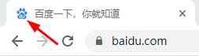

站点 Logo 地址如果为空会使用 `域名/favicon.ico`，你也可以把 ico 图标命名为 `favicon.ico`，然后上传到 Typecho 的根目录。

### 站点副标题

`站点副标题` 会显示在标签页标题的后面。

比如你的站点名称是 `程序员的博客`，副标题是 `生命不息，折腾不止。`,标签页显示的就是 `程序员的博客 - 生命不息，折腾不止。`。

站点副标题只会在首页的标签页显示。

### ICP备案号

如果你的网站备案过的话，可以在 `ICP 备案号` 填写 ICP 备案号，ICP 备案号会显示在网站的底部。

ICP 备案号输入框也可以填写链接，如下：

```html
<a href="http://xxx.xxx" target="_blank">京ICP备123456</a>
```

`href` 中的内容就是你要指向的网站。

## 导航

### 面包屑导航

面包屑导航会显示在导航栏的下方，显示的内容就是当前页面的路劲链接。

面包屑导航截图：

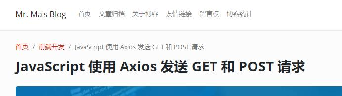

### 自定义导航栏链接

您可以在导航栏添加自定义链接，链接的名称和 URL 都可以自定义，导航栏链接需要使用 JSON 配置，

下面是一个导航栏链接配置：

```json
[
  {
    "name": "百度",
    "url": "https://www.baidu.com"
  },
  {
    "name": "腾讯",
    "url": "https://www.qq.com"
  }
]
```
`name` 是链接名称，`url` 就是链接地址。

### 站点 Logo 图片地址

站点 Logo 图片会显示在顶部导航栏的左侧，支持常见的图片格式，包括 SVG，只要能在 img 标签显示的图片都可以，留空会使用站点名称作为 Logo。

下面是导航栏 Logo 的效果：

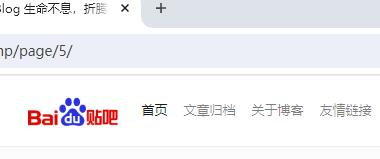

### 站点 Logo 图片高度限制

如果导航栏 Logo 图片尺寸较大的话，可能会把导航栏的高度撑的比较大，您可以通过限制 Logo 图片高度的方式来调整尺寸。图片高度可以直接传入数字，不需要加 px。

## 侧边栏

### 侧边栏组件

侧边栏组件可以设置要显示在侧边栏的组件和排序顺序，组件名称之间用英文逗号分隔，逗号之间不需要空格，结尾不需要逗号。

目前支持的组件如下：

* 博客信息
* 主题配色
* 最新文章
* 最新回复
* 文章分类
* 标签云
* 文章归档
* 其它功能
* 友情链接
* 目录（只能在文章页的侧边栏组件设置）
* 自定义

配置格式如下：

```markdown
博客信息,主题配色,最新文章,最新回复,文章分类,标签云,文章归档,其它功能,友情链接,自定义
```

不需要的组件可以不用填写。

下面是一些组件的说明和截图：

#### 博客信息

博客信息组件可以显示博主头像、博主昵称、博主简介、文章数量、评论数量、总阅读量、网站运行天数。

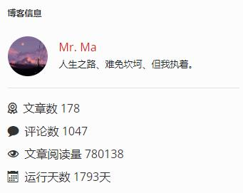

博客信息的大部分数据可以自动获取，少部分可能还需要手动补充，下面是博客信息组件的内容设置：

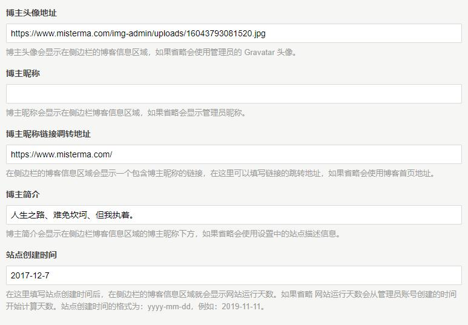

博主信息如果留空会使用博主的电子邮件地址来获取 Gravatar 头像显示，如果博主没有注册过 Gravatar 头像就会显示默认的 Gravatar 头像。

博主昵称如果留空会显示博主的用户昵称。

博主昵称链接调转地址如果留空会使用首页地址作为跳转地址。

博主简介如果留空会使用 Typecho 基本设置里设置的站点描述。

站点创建时间主要用来计算网站运行天数，格式为 `yyyy-mm-dd` ，例如 `2022-11-11` ，如果留空会使用博主账号的创建时间来计算运行天数。

#### 主题配色

主题配色组件可以让访问者手动切换主题配色。

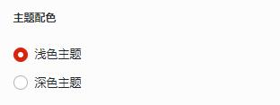

如果在侧边栏手动切换过主题配色，下次打开页面默认的配色就是手动切换的配色。

#### 最新文章

最新文章组件会显示最近的 10 篇文章。

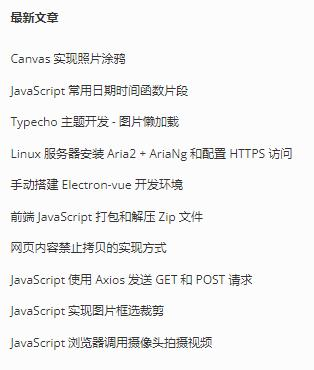

要更改最新文章的显示数量可以修改 Typecho `阅读设置` 的 `文章列表数目` 。

#### 最新回复

最新回复组件可以显示最近的 10 条评论和回复，点击可跳转到指定页面的指定评论区域。侧边栏的评论内容是不会换行的，评论内容的长度和侧边栏区域的宽度相关，超出宽度的内容会被省略。


要调整评论数量可以修改 Typecho `评论设置` 的 `评论列表数目` 。

#### 文章分类

文章分类组件会显示所有的文章分类和该分类包含的文章数量，点击可以查看该分类的文章，鼠标移入分类名称会通过气球提示框显示分类描述。

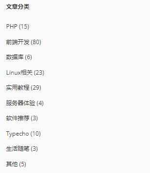

#### 标签云

标签云组件可以显示博客包含的标签和该标签包含的文章数量，点击可以查看该标签下的文章，标签颜色会在 7 种颜色中随机选择。

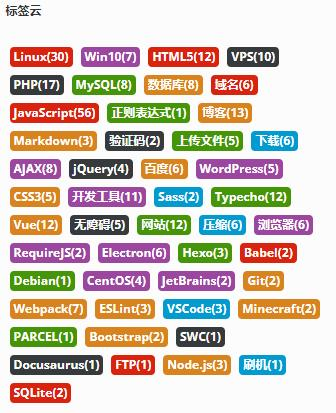

标签云默认会显示所有标签，如果你的标签较多的话，可以在主题设置的标签云标签数量设置限制。

#### 文章归档

文章归档组件可以显示按月份的文章归档，点击可以查看该月份下的文章。文章归档的列数和侧边栏的宽度相关。

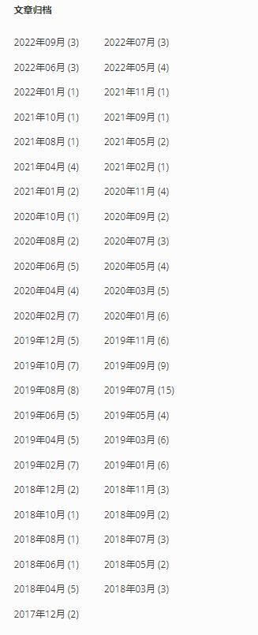

除了侧边栏组件外，Facile 也可以在独立页面显示时间线的文章归档，可以访问 [https://www.misterma.com/archives.html](https://www.misterma.com/archives.html) 查看。

#### 其它功能

其它功能组件主要包括登录入口和 RSS，

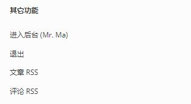

进入后台的入口在未登录的时候会显示为登录，如果不希望显示登录入口可以把 `登录入口` 设置为 `隐藏` 。

#### 友情链接

友情链接组件可以显示首页和全站的链接，首页链接只会在首页显示，全站链接会在每个页面显示。

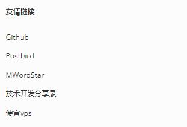

友情链接的配置在后面的友情链接设置会有详细说明。

#### 自定义

自定义组件可以显示自定义的 HTML，组件标题和显示的内容你都可以自己定义。

在侧边栏组件中启用 `自定义` 组件后还需要在 `侧边栏自定义 HTML 组件标题` 设置标题和 `侧边栏自定义 HTML 内容` 设置内容，只有 `侧边栏自定义 HTML 内容` 里有内，容组件才会显示。

设置标题和内容：

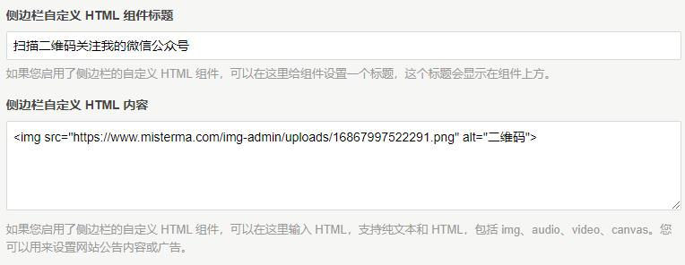

侧边栏自定义组件：


### 文章页的侧边栏组件

文章页的侧边栏组件可以单独配置文章页侧边栏组件的显示和排序，格式和侧边栏组件配置是一样的。

文章页加入了一个目录组件，目录的内容会根据文章内插入的标题生成，以 [MWordStar 双栏 Typecho 博客主题](https://www.misterma.com/archives/812/) 这篇文章为例，生成的目录如下：

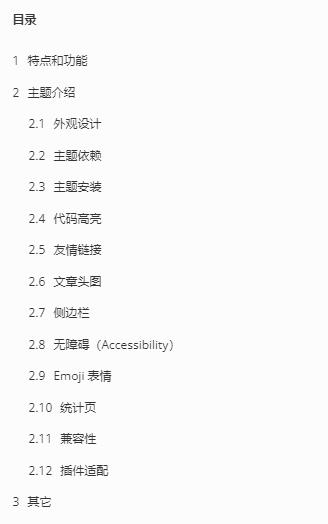

目录组件的组件名称就叫 `目录`，如果文章内容中不包含标题就不会显示目录组件。

目录组件在滚动到页面上方时，位置会被固定，建议把目录组件放到最后。

目录组件只能在文章页显示，不能在首页之类的页面显示。

## 文章相关

### 文章列表显示

文章列表显示设置可以设置文章列表的显示方式。目前支持的选项包括：

1. 文章列表直接显示全文
2. 文章列表显示摘要和文章头图

文章列表包括 首页、分类归档页、标签归档页、日期归档页、搜索页左侧的文章列表，`文章列表直接显示全文` 就是直接在文章列表显示全部的文章内容，不包括评论。在文章列表显示全文的情况下，也可以使用 `<--more-->` 来手动分割摘要。

在每篇文章的文章编辑页也可以单独设置文章列表显示。

### 文章摘要字数

文章摘要字数可以设置首页、分类页、标签页、归档页、搜索页左侧文章列表的摘要字数。如果想给不同的文章设置不同的摘要字数可以在文章编辑页设置自定义文章摘要。

### 移动设备章节目录

小屏幕的移动设备会使用单独的章节目录，不会使用大屏设备的侧边栏章节目录。

小屏幕的章节目录默认是隐藏的，需要点击目录按钮才会显示，这里可以设置是否启用小屏幕的章节目录，禁用后不会显示目录按钮。

以 [使用 VuePress 为开源项目和产品生成帮助文档](https://www.misterma.com/archives/919/) 这篇文章为例，小屏幕设备的章节目录如下：

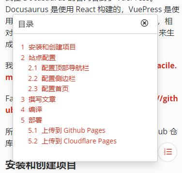

### 代码高亮

这里可以启用或禁用文章内的代码块高亮效果，如果你需要使用代码高亮插件的话，可以禁用主题自带的高亮效果。

### 代码块显示行号

代码块显示行号可以设置文章页和独立页面的代码块是否显示行号，代码块的效果可以访问 [代码高亮](/代码高亮.md) 查看。

### 代码块颜色主题

代码块颜色主题可以设置文章页和独立页面的代码块的配色主题，代码块的效果可以访问 [代码高亮](/代码高亮.md) 查看。

### 图片懒加载

图片懒加载开启后，文章内可视区外的图片不会自动加载，只有图片进入可视区才会加载。这里说的可视区就是你能看到的区域，如果你的文章内容较多的话，进入页面时只有出现在屏幕内的图片会加载，下方的图片只有出现在可视区才会加载。

对于带宽较低的服务器，开启图片懒加载可以避免因为多张图片同时加载导致长时间看不到图片的情况。

### 文章头图显示设置

文章头图显示设置可以统一设置文章页和文章列表的头图显示，文章页包括独立页面和文章页，文章列表包括首页、分类页、标签页、归档页、搜索页左侧的文章列表。

你也可以在文章编辑页给单篇文章设置头图显示，单篇文章的头图设置优先级高于全局设置。

### 文章列表的文章头图样式

文章列表的文章头图样式可以统一设置首页、分类页、标签页、归档页、搜索页左侧列表的头图样式。大头图和小头图的效果可以访问 [主题简介](/主题简介.md) 查看图片。

你也可以在文章编辑页给单篇文章设置头图样式，单篇文章的头图设置优先级高于全局设置。

### 文章头图风格

文章头图风格可以设置文章头图使用直角还是圆角。

### 默认文章头图

默认文章头图可以设置文章头图随机图片，一行一个图片 URL，系统会随机选择一个地址来加载图片。使用默认文章头图的文章，文章编辑页的默认文章头图需要设置为 `使用系统设置` 。

### 文章底部的交互功能

设置文章页底部的交互功能和按钮，支持的功能包括 `点赞,打赏,分享`，功能之间用英文逗号分隔，逗号和名称之间不需要空格，结尾不需要逗号，功能按钮的排序方式会根据这里设置的名称顺序排序。

下面是几个功能按钮：


文章的分享链接和二维码默认是隐藏的，需要点击 `分享` 按钮才会显示。

### 打赏二维码图片地址

文章底部的交互功能可以配置一个 `打赏` 按钮，点击后可以显示一个二维码图片，你可以在这里填写图片地址。图片的最大宽度和文章区域的宽度是一样的，高度不限制，图片会居中显示。

## 评论

### 评论日期时间格式

评论日期时间格式可以设置评论日期时间的显示格式，支持的格式包括：

* 2020年04月23日 13:09
* 2020-04-23 13:09
* April 23rd, 2020 at 01:09 pm
* 时间间隔（3天前）

时间间隔的单位会根据间隔长短变化，不到一分钟的单位为 秒，一分钟以上、一小时以下的单位为 分钟，一小时以上、一天以下的单位为 小时，一天以上的单位为 天，

### 评论框位置

评论框位置可以设置评论表单和评论列表的位置，评论框就是发表评论的区域，评论列表就是评论内容显示区域。

最新的评论会显示在上方，建议把评论框放在上方，大多数网站的评论框也是在上方。

### 显示评论者的QQ头像

开启显示评论者的QQ头像后，如果检测到评论者的邮箱地址是 `QQ号@qq.com` 就会显示QQ头像，QQ邮箱只支持带QQ号的邮箱地址，不支持 foxmail 地址。

### 自定义 Gravatar 源

Gravatar 官方的头像源在中国大陆地区可能无法正常加载，如果你需要更换 Gravatar 源的话，可以在这里输入 URL，留空会使用官方源。

这里更改的只是前台的 Gravatar 源，后台评论管理使用的还是官方的 Gravatar 源。

### Emoji 表情面板

开启 Emoji 表情面板后在评论内容输入框下方会显示一个 Emoji表情按钮，点击可以打开表情面板，表情面板目前包含 1466 个表情，这些表情都是动态加载的，不用担心性能问题。

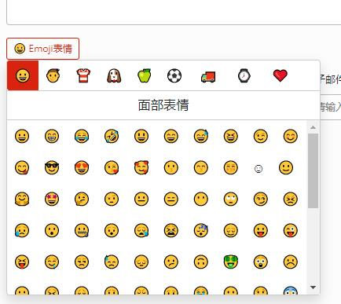

## 友情链接

友情链接分为 `全站友情链接`、`首页友情链接`、`内页友情链接`。全站友情链接会在每个页面的侧边栏显示，首页友情链接会在首页的侧边栏显示，内页友情链接只会在友情链接的页面显示。

友情链接可以使用 JSON 配置，也可以使用链接编辑器配置，链接编辑器无需输入 JSON。

### 设置全站友情链接

在 `全站友情链接` 的输入框填写 JSON 数据，如下：

```json
[
    {
        "url": "https://www.baidu.com",
        "name": "百度",
        "title": "百度一下，你就知道。"
    },
    {
        "url": "https://www.misterma.com",
        "name": "Mr. Ma`s Blog",
        "title": "我的编程学习笔记和一些计算机的实用教程"
    }
]
```

其中 `url` 和 `name` 是必填项，`title` 如果省略，简介区域会显示为 `暂无简介`。

全站链接的效果可以查看侧边栏设置的 `友情链接` 组件截图。

### 设置首页友情链接

设置首页友情链接的方法和全站友情链接差不多，在 `首页友情链接` 的输入框中输入 JSON 数据，数据格式和全站友情链接是一样的。

首页友情链接的效果和全站友情链接的效果差不多，只是首页友情链接只会在首页显示。

### 设置独立页友情链接

新建一个独立页面，把 `自定义模板` 设置为 `友情链接`。

在主题设置的 `独立页友情链接` 输入框中填写 JSON 数据，如下：

```json
[
    {
        "url": "https://www.baidu.com",
        "name": "百度",
        "title": "百度一下，你就知道。",
        "logoUrl": "https://tupp.xyz/2019/08/05/15650063025d4819debebc6.jpg"
    },
    {
        "url": "https://www.misterma.com",
        "name": "Mr Ma`s Blog",
        "title": "我的编程学习笔记和一些计算机的实用教程",
        "logoUrl": "https://www.misterma.com/img/%E5%8D%9A%E5%AE%A2Logo.png"
    }
]
```

`logoUrl` 如果省略，在 Logo 区域会显示链接图标。

独立页友链的效果如下：

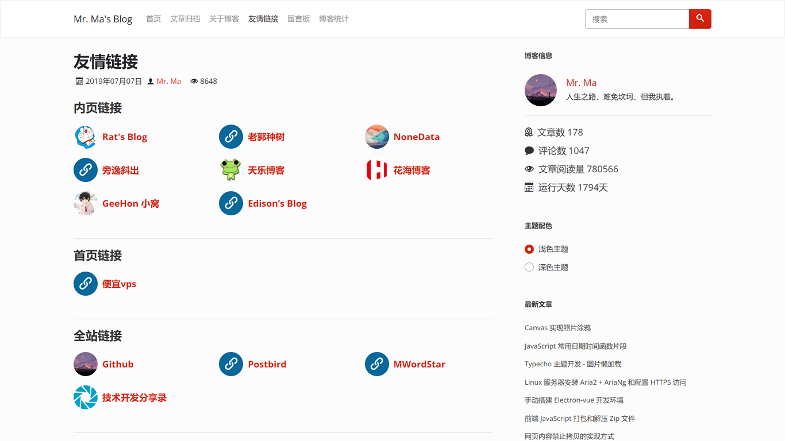

### 链接编辑器

每个友情链接配置输入框的下方都有一个 `打开链接编辑器` 的按钮，点击可以打开链接编辑器编辑。

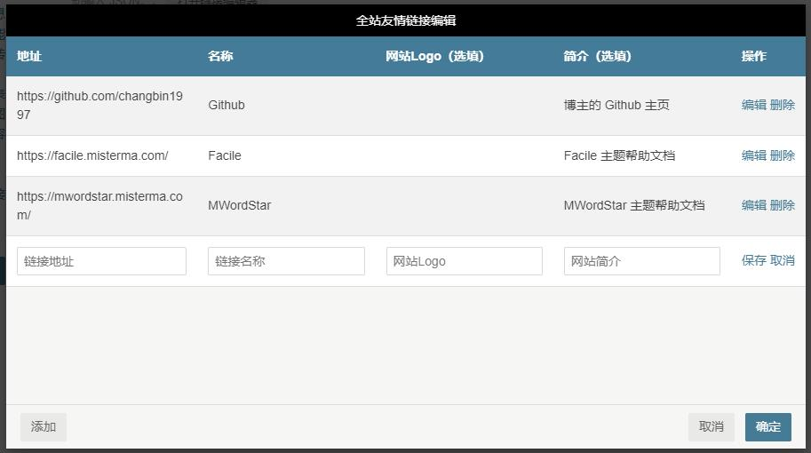

链接编辑器会读取对应的链接配置，你可以很方便的添加、删除、编辑链接，点击 `确定` 后链接编辑器的链接会被添加到对应的输入框。

## PJAX

PJAX 在页面跳转时只会更新内容部分，不会刷新整个页面，可以实现类似于单页应用的使用体验。

### 启用PJAX

你可以根据需要选择开启或关闭 PJAX 功能。

注意，目前 Typecho 主题的 PJAX 还无法做到和 Typecho 程序完美兼容，如果要启用 PJAX，需要在 Typecho 评论设置中关闭 `开启反垃圾保护` 和 `检查评论来源页 URL 是否与文章链接一致`，否则评论可能无法成功发送！

### PJAX进度条

PJAX 进度条会显示在页面顶部，在 PJAX 页面内容更新时，进度条会显示更新进度，更新完成后进度条会隐藏。禁用 PJAX 进度条不会影响 PJAX 功能。

PJAX 进度条显示的是 PJAX 的几个更新阶段，不会详细到 HTTP 的上传和下载进度。

### PJAX 更新完成后要执行的 JS 代码

你可以在这里填写 JS 代码，PJAX 每次更新完成后都会执行这里的 JS 代码，JS 代码不需要包含 `script` 标签。

## 开发者

### 自定义 CSS

通过自定义 CSS 您可以很方便的设置页面样式，自定义 CSS 不会影响网站源代码。

### 自定义 head 区域输出的 HTML

自定义 head 区域的 HTML 会在 `</head>` 之前输出。您可以用来定义网站统计的 JS 或者 自定义 JS。

### 自定义 body 底部输出的 HTML

自定义 body 区域的 HTML 会在 </footer> 之后 </body> 之前输出。。您可以用来定义网站统计的 JS 或者 自定义 JS。
