# 主题设置

## 进入主题设置

登录 Typecho 后台，在顶部导航栏的 `控制台` 菜单选择 `外观` ，进入主题选择页后点击 `设置外观` ，如下图：

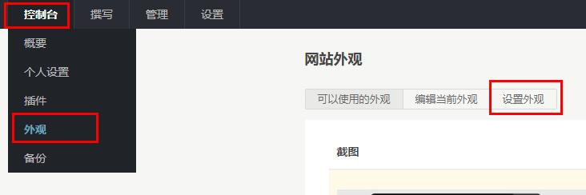

## 语言

### 默认显示的语言

用户访问网站时看到的语言，目前支持 `简体中文`、`英文`、`自动选择语言` 。

自动选择语言会根据 HTTP 请求的语言偏好来选择语言，一般浏览器发送的语言偏好就是系统使用的语言，Google 之类的搜索引擎爬虫发送的大多是英文。

如果 HTTP 发送的语言偏好不是主题支持的语言，或者 HTTP 请求不包含语言偏好，默认显示英文。

### 语言切换按钮

语言切换按钮会显示在导航栏，点击会弹出一个下拉菜单：

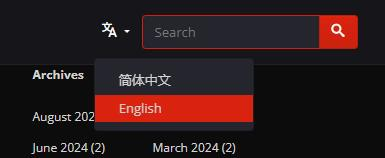

用户选择的语言会通过 Cookie 保存到浏览器，用户下次访问时，使用的就是选择的语言。

## 外观

### 默认主题配色

默认主题配色可以设置用户访问你的网站时使用的配色，你也可以在侧边栏添加一个配色切换组件来让用户自己选择。

默认主题配色目前支持 `浅色` 、`深色` 、`跟随系统主题` 。

跟随系统主题就是根据用户的系统配色来自动选择浅色或深色，目前 Windows 系统只有较新的 Win10 和 Win11 支持，IE 11 不支持，默认会显示浅色。iOS 只有包含深色模式的版本才支持。

不支持跟随系统主题的用户设备默认会使用浅色配色。

## 站点信息

### 站点 Logo 地址

Logo 是一个 `.ico` 格式的 icon 图标，会显示在浏览器标签页标题的前面，如下：

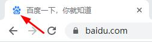

站点 Logo 地址如果为空会使用 `域名/favicon.ico`，你也可以把 ico 图标命名为 `favicon.ico`，然后上传到 Typecho 的根目录。

### 站点副标题

`站点副标题` 会显示在标签页标题的后面。

比如你的站点名称是 `程序员的博客`，副标题是 `生命不息，折腾不止。`,标签页显示的就是 `程序员的博客 - 生命不息，折腾不止。`。

站点副标题只会在首页的标签页显示。

### ICP备案号

如果你的网站备案过的话，可以在 `ICP 备案号` 填写 ICP 备案号，ICP 备案号会显示在网站的底部。

ICP 备案号输入框也可以填写链接，如下：

```html
<a href="http://xxx.xxx" target="_blank">京ICP备123456</a>
```

`href` 中的内容就是你要指向的网站。

## 导航

### 面包屑导航

面包屑导航会显示在导航栏的下方，显示的内容就是当前页面的路劲链接。

面包屑导航截图：

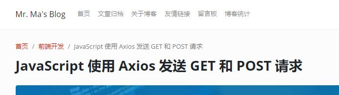

### 自定义导航栏链接

您可以在导航栏添加自定义链接，链接的名称和 URL 都可以自定义，导航栏链接需要使用 JSON 配置，

下面是一个导航栏链接配置：

```json
[
  {
    "name": "百度",
    "url": "https://www.baidu.com"
  },
  {
    "name": "腾讯",
    "url": "https://www.qq.com"
  }
]
```
`name` 是链接名称，`url` 就是链接地址。

自定义导航栏链接还支持下拉菜单，您可以在要显示下拉菜单的链接项中加入 `menu` 数组，在 `menu` 数组中使用 `name` 和 `url` 配置链接。

下面是一个包含下拉菜单的链接配置：

```json
[
  {
    "name": "我的Github",
    "url": "https://github.com/changbin1997"
  },
  {
    "name": "我的博客",
    "url": "https://www.misterma.com"
  },
  {
    "name": "主题帮助文档",
    "menu": [
      {
        "name": "Facile",
        "url": "https://facile.misterma.com"
      },
      {
        "name": "MWordStar",
        "url": "https://mwordstar.misterma.com"
      }
    ]
  }
]
```

效果如下：

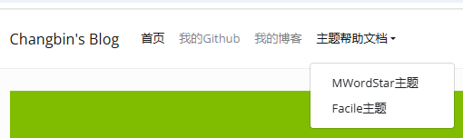

### 站点 Logo 图片地址

站点 Logo 图片会显示在顶部导航栏的左侧，支持常见的图片格式，包括 SVG，只要能在 img 标签显示的图片都可以，留空会使用站点名称作为 Logo。

下面是导航栏 Logo 的效果：

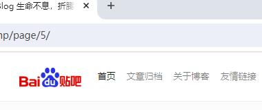

### 深色模式 Logo 图片地址

主题包含浅色和深色模式，如果您希望浅色模式和深色模式显示不同的 Logo，可以在这里填写深色模式的 Logo 图片 URL。如果需要深色模式和浅色模式都使用同一个 Logo 图片，可以只填写上方的 `站点 Logo 图片地址`，这里可以留空。

下面是导航栏 Logo 填写和调用说明：

1. 如果不填写 `站点 Logo 图片地址` ，默认使用文字 Logo，也就是站点名称。
2. 如果只填写 `站点 Logo 图片地址` ，不填写 `深色模式 Logo 图片地址` ，深色和浅色模式都使用 `站点 Logo 图片地址` 。
3. 如果同时填写了 `站点 Logo 图片地址` 和 `深色模式 Logo 图片地址` ，浅色模式使用 `站点 Logo 图片地址` ，深色模式使用 `深色模式 Logo 图片地址` 。
4. 如果只填写 `深色模式 Logo 图片地址` ，不填写 `站点 Logo 图片地址` ，导航栏 Logo 使用文字 Logo。

如果导航栏要使用图片 Logo，`站点 Logo 图片地址` 是必填的。

### 站点 Logo 图片高度限制

如果导航栏 Logo 图片尺寸较大的话，可能会把导航栏的高度撑的比较大，您可以通过限制 Logo 图片高度的方式来调整尺寸。图片高度可以直接传入数字，不需要加 px。

## 侧边栏

### 侧边栏组件

侧边栏组件可以设置要显示在侧边栏的组件和排序顺序，组件名称之间用英文逗号分隔，逗号之间不需要空格，结尾不需要逗号。

目前支持的组件如下：

* 博客信息
* 主题配色
* 最新文章
* 最新回复
* 文章分类
* 标签云
* 文章归档
* 其它功能
* 友情链接
* 目录（只能在文章页的侧边栏组件设置）
* 自定义
* 语言选择

配置格式如下：

```markdown
博客信息,主题配色,最新文章,最新回复,文章分类,标签云,文章归档,其它功能,友情链接,自定义
```

不需要的组件可以不用填写。

下面是一些组件的说明和截图：

#### 博客信息

博客信息组件可以显示博主头像、博主昵称、博主简介、文章数量、评论数量、总阅读量、网站运行天数。

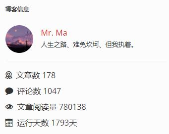

博客信息的大部分数据可以自动获取，少部分可能还需要手动补充，下面是博客信息组件的内容设置：

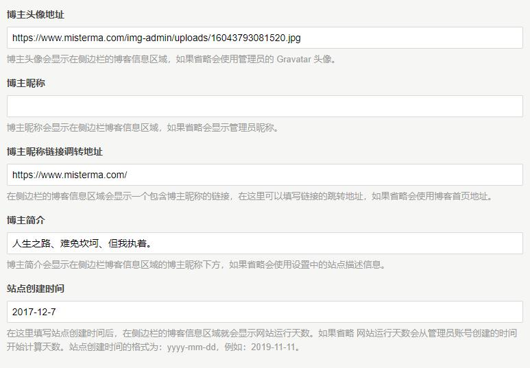

博主信息如果留空会使用博主的电子邮件地址来获取 Gravatar 头像显示，如果博主没有注册过 Gravatar 头像就会显示默认的 Gravatar 头像。

博主昵称如果留空会显示博主的用户昵称。

博主昵称链接调转地址如果留空会使用首页地址作为跳转地址。

博主简介如果留空会使用 Typecho 基本设置里设置的站点描述。

站点创建时间主要用来计算网站运行天数，格式为 `yyyy-mm-dd` ，例如 `2022-11-11` ，如果留空会使用博主账号的创建时间来计算运行天数。

#### 主题配色

主题配色组件可以让访问者手动切换主题配色。

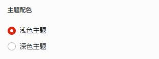

如果在侧边栏手动切换过主题配色，下次打开页面默认的配色就是手动切换的配色。

#### 最新文章

最新文章组件会显示最近的 10 篇文章。

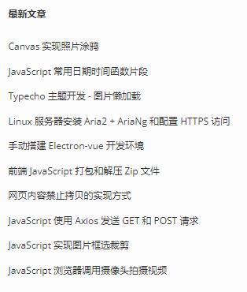

要更改最新文章的显示数量可以修改 Typecho `阅读设置` 的 `文章列表数目` 。

#### 最新回复

最新回复组件可以显示最近的 10 条评论和回复，点击可跳转到指定页面的指定评论区域。侧边栏的评论内容是不会换行的，评论内容的长度和侧边栏区域的宽度相关，超出宽度的内容会被省略。


要调整评论数量可以修改 Typecho `评论设置` 的 `评论列表数目` 。

#### 文章分类

文章分类组件会显示所有的文章分类和该分类包含的文章数量，点击可以查看该分类的文章，鼠标移入分类名称会通过气球提示框显示分类描述。

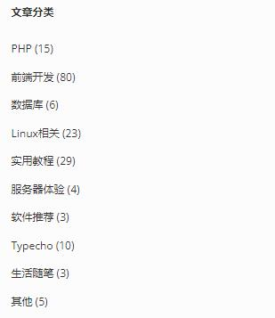

#### 标签云

标签云组件可以显示博客包含的标签和该标签包含的文章数量，点击可以查看该标签下的文章，标签颜色会在 7 种颜色中随机选择。

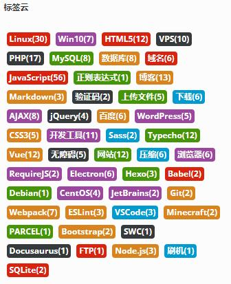

标签云默认会显示所有标签，如果你的标签较多的话，可以在主题设置的标签云标签数量设置限制。

#### 文章归档

文章归档组件可以显示按月份的文章归档，点击可以查看该月份下的文章。文章归档的列数和侧边栏的宽度相关。

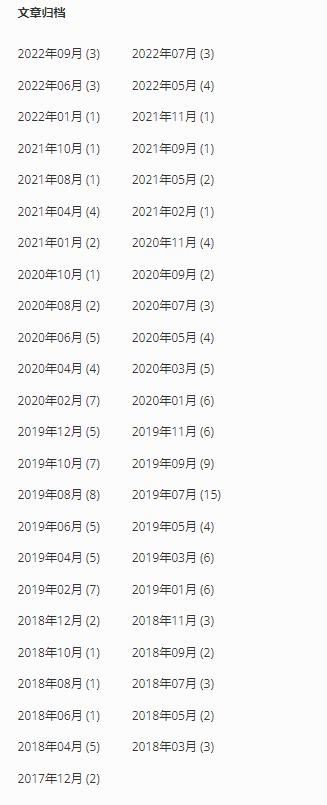

除了侧边栏组件外，Facile 也可以在独立页面显示时间线的文章归档，可以访问 [https://www.misterma.com/archives.html](https://www.misterma.com/archives.html) 查看。

#### 其它功能

其它功能组件主要包括登录入口和 RSS，

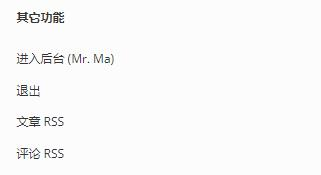

进入后台的入口在未登录的时候会显示为登录，如果不希望显示登录入口可以把 `登录入口` 设置为 `隐藏` 。

#### 友情链接

友情链接组件可以显示首页和全站的链接，首页链接只会在首页显示，全站链接会在每个页面显示。

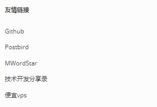

友情链接的配置在后面的友情链接设置会有详细说明。

#### 自定义

自定义组件可以显示自定义的 HTML，组件标题和显示的内容你都可以自己定义。

在侧边栏组件中启用 `自定义` 组件后还需要在 `侧边栏自定义 HTML 组件标题` 设置标题和 `侧边栏自定义 HTML 内容` 设置内容，只有 `侧边栏自定义 HTML 内容` 里有内，容组件才会显示。

设置标题和内容：

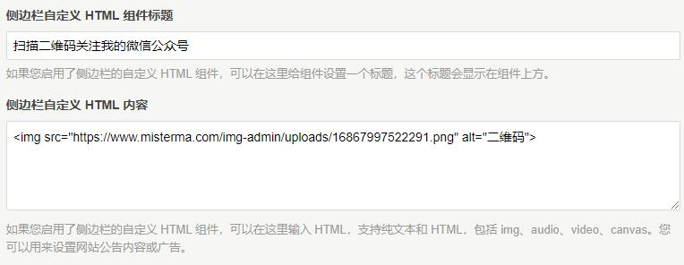

侧边栏自定义组件：


#### 语言选择

语言选择组件和语言切换按钮的功能是一样的，语言选择组件会直接把支持的语言显示在侧边栏，可以更方便的切换语言：

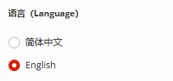

语言选择按钮和语言选择组件你都可以同时启用和禁用。

### 文章页的侧边栏组件

文章页的侧边栏组件可以单独配置文章页侧边栏组件的显示和排序，格式和侧边栏组件配置是一样的。

文章页加入了一个目录组件，目录的内容会根据文章内插入的标题生成，以 [MWordStar 双栏 Typecho 博客主题](https://www.misterma.com/archives/812/) 这篇文章为例，生成的目录如下：

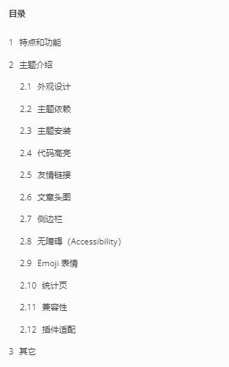

目录组件的组件名称就叫 `目录`，如果文章内容中不包含标题就不会显示目录组件。

目录组件在滚动到页面上方时，位置会被固定，建议把目录组件放到最后。

目录组件只能在文章页显示，不能在首页之类的页面显示。

## 文章相关

### 文章列表显示

文章列表显示设置可以设置文章列表的显示方式。目前支持的选项包括：

1. 文章列表直接显示全文
2. 文章列表显示摘要和文章头图

文章列表包括 首页、分类归档页、标签归档页、日期归档页、搜索页左侧的文章列表，`文章列表直接显示全文` 就是直接在文章列表显示全部的文章内容，不包括评论。在文章列表显示全文的情况下，也可以使用 `<--more-->` 来手动分割摘要。

在每篇文章的文章编辑页也可以单独设置文章列表显示。

### 文章列表分页方式

设置首页和其它归档页的文章列表分页方式，支持的选项包括：

* 数字分页链接
* 点击加载更多

`数字分页链接` 就是传统的包含页码和前后页的翻页链接。`点击加载更多` 会在文章列表底部显示一个加载更多的按钮，点击会加载更多的文章到文章列表，页面不会跳转。

`点击加载更多` 和 `文章列表直接显示全文` 不建议同时开启。

### 文章摘要字数

文章摘要字数可以设置首页、分类页、标签页、归档页、搜索页左侧文章列表的摘要字数。如果想给不同的文章设置不同的摘要字数可以在文章编辑页设置自定义文章摘要。

### 移动设备章节目录

小屏幕的移动设备会使用单独的章节目录，不会使用大屏设备的侧边栏章节目录。

小屏幕的章节目录默认是隐藏的，需要点击目录按钮才会显示，这里可以设置是否启用小屏幕的章节目录，禁用后不会显示目录按钮。

以 [使用 VuePress 为开源项目和产品生成帮助文档](https://www.misterma.com/archives/919/) 这篇文章为例，小屏幕设备的章节目录如下：

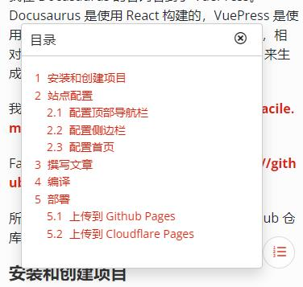

### 代码高亮

这里可以启用和禁用文章内的代码块高亮效果，如果你需要使用代码高亮插件的话，可以禁用主题自带的高亮效果。

### 代码块显示行号

代码块显示行号可以设置文章页和独立页面的代码块是否显示行号，代码块的效果可以访问 [代码高亮](/代码高亮.md) 查看。

### 代码块颜色主题

代码块颜色主题可以设置文章页和独立页面的代码块的配色主题，代码块的效果可以访问 [代码高亮](/代码高亮.md) 查看。

### 自定义代码块颜色主题

要使用 `自定义代码块颜色主题` ，`代码块颜色主题` 需要设置为 `自定义` 。

你可以输入 highlight.js 的配色 CSS URL，也可以直接粘贴 highlight.js 的 CSS 代码。

访问 [https://cdnjs.com/libraries/highlight.js](https://cdnjs.com/libraries/highlight.js) 可以获取 highlight.js 的 CSS，你可以选择一个需要的 CSS 主题拷贝地址：

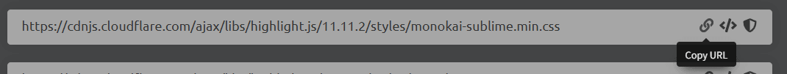

拷贝后可以直接粘贴到 `自定义代码块颜色主题` 使用。

如果你感觉 CDN 加载太慢，你也可以在浏览器地址栏打开 CSS，把 CSS 代码拷贝到 `自定义代码块颜色主题` 粘贴使用：

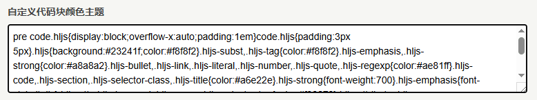

要查看不同颜色主题的效果可以访问 [https://highlightjs.org/demo](https://highlightjs.org/demo) 。

使用自定义代码块颜色主题时，建议关闭 `代码块显示行号` ，主题的代码块行号只能适配内置的代码块颜色主题。

### 短代码

短代码是 Facile 主题提供的一种特殊语法，通过短代码可以插入一些特殊样式的内容和小组件。

详细的短代码可以查看主题帮助文档的 [短代码](https://facile.misterma.com/%E7%9F%AD%E4%BB%A3%E7%A0%81.html) 说明。

如果您需要使用其它短代码插件，可以关闭主题的短代码功能。

### MathJax支持

MathJax 是一个数学公式渲染库，可支持 LaTeX、MathML、AsciiMath 的渲染。

主题没有直接打包 MathJax 库，需要通过在线 CDN 加载，国内也可以正常加载。

启用后，只有检测到文章内有 MathJax 标记才会加载。

### 图片懒加载

图片懒加载开启后，文章内可视区外的图片不会自动加载，只有图片进入可视区才会加载。这里说的可视区就是你能看到的区域，如果你的文章内容较多的话，进入页面时只有出现在屏幕内的图片会加载，下方的图片只有出现在可视区才会加载。

对于带宽较低的服务器，开启图片懒加载可以避免因为多张图片同时加载导致长时间看不到图片的情况。

`原生图片懒加载`: 使用浏览器原生支持的 `loading` 属性来设置图片懒加载，不需要依赖 JavaScript，浏览器可以自己实现图片懒加载，性能更好，不兼容老旧浏览器，老旧浏览器还是按照正常的方式加载图片。

`兼容性图片懒加载`: 通过 JavaScript 检测和加载图片，如果 JS 加载失败可能无法显示图片，搜索引擎无法获取图片，但可兼容老旧浏览器。

### 文章头图显示设置

文章头图显示设置可以统一设置文章页和文章列表的头图显示，文章页包括独立页面和文章页，文章列表包括首页、分类页、标签页、归档页、搜索页左侧的文章列表。

你也可以在文章编辑页给单篇文章设置头图显示，单篇文章的头图设置优先级高于全局设置。

### 文章列表的文章头图样式

文章列表的文章头图样式可以统一设置首页、分类页、标签页、归档页、搜索页左侧列表的头图样式。大头图和小头图的效果可以访问 [主题简介](/主题简介.md) 查看图片。

你也可以在文章编辑页给单篇文章设置头图样式，单篇文章的头图设置优先级高于全局设置。

### 文章头图风格

文章头图风格可以设置文章头图使用直角还是圆角。

### 默认文章头图

默认文章头图可以设置文章头图随机图片，一行一个图片 URL，系统会随机选择一个地址来加载图片。使用默认文章头图的文章，文章编辑页的默认文章头图需要设置为 `使用系统设置` 。

### 文章底部的交互功能

设置文章页底部的交互功能和按钮，支持的功能包括 `点赞,打赏,分享`，功能之间用英文逗号分隔，逗号和名称之间不需要空格，结尾不需要逗号，功能按钮的排序方式会根据这里设置的名称顺序排序。

下面是几个功能按钮：


文章的分享链接和二维码默认是隐藏的，需要点击 `分享` 按钮才会显示。

### 打赏二维码图片地址

文章底部的交互功能可以配置一个 `打赏` 按钮，点击后可以显示一个二维码图片，你可以在这里填写图片地址。图片的最大宽度和文章区域的宽度是一样的，高度不限制，图片会居中显示。

## 评论

### 评论日期时间格式

评论日期时间格式可以设置评论日期时间的显示格式，支持的格式包括：

* 2020年04月23日 13:09
* 2020-04-23 13:09
* April 23rd, 2020 at 01:09 pm
* 时间间隔（3天前）

时间间隔的单位会根据间隔长短变化，不到一分钟的单位为 秒，一分钟以上、一小时以下的单位为 分钟，一小时以上、一天以下的单位为 小时，一天以上的单位为 天，

### 评论框位置

评论框位置可以设置评论表单和评论列表的位置，评论框就是发表评论的区域，评论列表就是评论内容显示区域。

最新的评论会显示在上方，建议把评论框放在上方，大多数网站的评论框也是在上方。

### 显示评论者的QQ头像

开启显示评论者的QQ头像后，如果检测到评论者的邮箱地址是 `QQ号@qq.com` 就会显示QQ头像，QQ邮箱只支持带QQ号的邮箱地址，不支持 foxmail 地址。

### 自定义 Gravatar 源

Gravatar 官方的头像源在中国大陆地区可能无法正常加载，如果你需要更换 Gravatar 源的话，可以在这里输入 URL，留空会使用官方源。

这里更改的只是前台的 Gravatar 源，后台评论管理使用的还是官方的 Gravatar 源。

### Emoji 表情面板

开启 Emoji 表情面板后在评论内容输入框下方会显示一个 Emoji表情按钮，点击可以打开表情面板，表情面板目前包含 1466 个表情，这些表情都是动态加载的，不用担心性能问题。

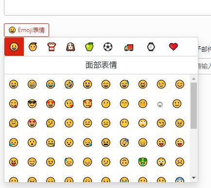

## 评论验证码

验证码可以防止机器人脚本发送评论，如果你的网站经常收到大量垃圾评论，可以考虑开启验证码。

支持的验证码包括：

* `图片算数验证码`: 通过图片显示简单的算术题，目前生成的是 10 以下的加法。
* `Cloudflare Turnstile`: 通过点击复选框完成验证，如果你的网络和浏览器环境没有问题，可以自动完成验证。

图片验证码开启就可以使用，Cloudflare Turnstile 需要注册账号才能使用。

### 图片验证码

图片验证码可以防住大多数的通用评论脚本，但是如果是专门为你的网站编写的脚本 + OCR 就很难防住了。

考虑到用户体验，我的图片验证码不会有太复杂的干扰，还是比较容易看清的。

下面是图片验证码效果：

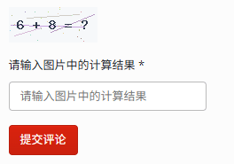

点击验证码图片可以更换验证码。

生成验证码使用密钥 + 哈希算法对结果进行加密，然后发送到前端，最后和输入的验证码一起提交验证，验证码有效期 5 分钟，不需要 session 存储。

你可以在 `评论验证码密钥` 输入用于加密的密钥，默认使用 `12345678` 。

### Cloudflare Turnstile

Cloudflare Turnstile 是 Cloudflare 的验证码服务，类似于 Google 的  reCAPTCHA，但是 Turnstile 体验要比 reCAPTCHA 好，不会要求选择图片，而且  Turnstile 没有被墙。

Cloudflare Turnstile 是免费使用的，只需要到 https://www.cloudflare.com/products/turnstile/ 注册账号，获取 Sitekey 和 Secret key 就可以使用了。

下面是 Cloudflare Turnstile 的效果：

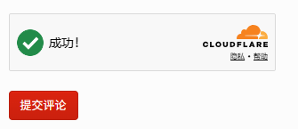

Cloudflare Turnstile 会根据你的网站和浏览器环境，浏览方式，包括鼠标轨迹和键盘之类的来分析验证，应该很少有评论脚本能通过验证。

有的运营商宽带晚上访问 Cloudflare Turnstile，速度可能会比较慢。

## SEO相关

### 搜索结果页添加 noindex 标签

Typecho 提交搜索后，即便搜索不到内容也不会出现 404 和其它错误提示，而且搜索页面的标题中还会包含搜索词。

有些人会利用这种特性来进行 SEO 投毒，比如用脚本在各种网站批量投放 `http://你的域名/search/广告词`，搜索引擎可能会抓取和收录这些地址的页面，虽然进入页面也搜索不到任何内容，但是会在 Google 搜索结果页面留下这些广告词。

开启 `搜索结果页添加 noindex 标签` 后，会在搜索结果页的 `head` 区域添加 noindex，告诉 Google 之类的搜索引擎不要收录网站的搜索结果页。

### 日期归档页添加 noindex 标签

Typecho 可以按月份和日期生成文章归档，如果你的网站建站时间较早，可能会生成大量的文章归档链接和页面。

在有分类归档和标签归档的情况下，这些大量的日期归档页面可能会被搜索引擎识别为重复页面，大量的重复页面可能会影响到文章页面的权重。

大多数人也不会再搜索引擎搜索归档页面。

开启 `日期归档页添加 noindex 标签` 后，会在日期归档页的 `head` 区域添加 noindex，告诉搜索引擎不要收录日期归档页。

### 作者归档页添加 noindex 标签

开启后会在作者归档页的 head 区域添加 noindex，告诉搜索引擎不要收录作者归档页。

如果你的 Typecho 没有开放作者注册，只有一个作者的情况下，作者归档页和首页的内容基本上是差不多的，对于搜索引擎来说，这也是重复页面。

## 友情链接

友情链接分为 `全站友情链接`、`首页友情链接`、`内页友情链接`。全站友情链接会在每个页面的侧边栏显示，首页友情链接会在首页的侧边栏显示，内页友情链接只会在友情链接的页面显示。

友情链接可以使用 JSON 配置，也可以使用链接编辑器配置，链接编辑器无需输入 JSON。

### 设置全站友情链接

在 `全站友情链接` 的输入框填写 JSON 数据，如下：

```json
[
    {
        "url": "https://www.baidu.com",
        "name": "百度",
        "title": "百度一下，你就知道。"
    },
    {
        "url": "https://www.misterma.com",
        "name": "Mr. Ma`s Blog",
        "title": "我的编程学习笔记和一些计算机的实用教程"
    }
]
```

其中 `url` 和 `name` 是必填项，`title` 如果省略，简介区域会显示为 `暂无简介`。

全站链接的效果可以查看侧边栏设置的 `友情链接` 组件截图。

### 设置首页友情链接

设置首页友情链接的方法和全站友情链接差不多，在 `首页友情链接` 的输入框中输入 JSON 数据，数据格式和全站友情链接是一样的。

首页友情链接的效果和全站友情链接的效果差不多，只是首页友情链接只会在首页显示。

### 设置独立页友情链接

新建一个独立页面，把 `自定义模板` 设置为 `友情链接`。

在主题设置的 `独立页友情链接` 输入框中填写 JSON 数据，如下：

```json
[
    {
        "url": "https://www.baidu.com",
        "name": "百度",
        "title": "百度一下，你就知道。",
        "logoUrl": "https://tupp.xyz/2019/08/05/15650063025d4819debebc6.jpg"
    },
    {
        "url": "https://www.misterma.com",
        "name": "Mr Ma`s Blog",
        "title": "我的编程学习笔记和一些计算机的实用教程",
        "logoUrl": "https://www.misterma.com/img/%E5%8D%9A%E5%AE%A2Logo.png"
    }
]
```

`logoUrl` 如果省略，在 Logo 区域会显示链接图标。

独立页友链的效果如下：

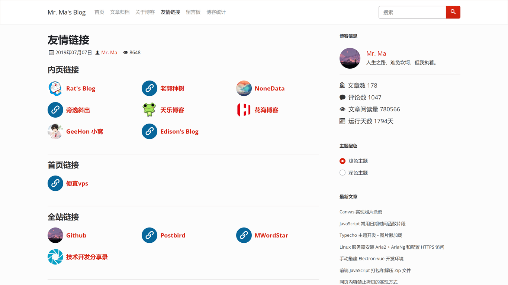

### 链接编辑器

每个友情链接配置输入框的下方都有一个 `打开链接编辑器` 的按钮，点击可以打开链接编辑器编辑。

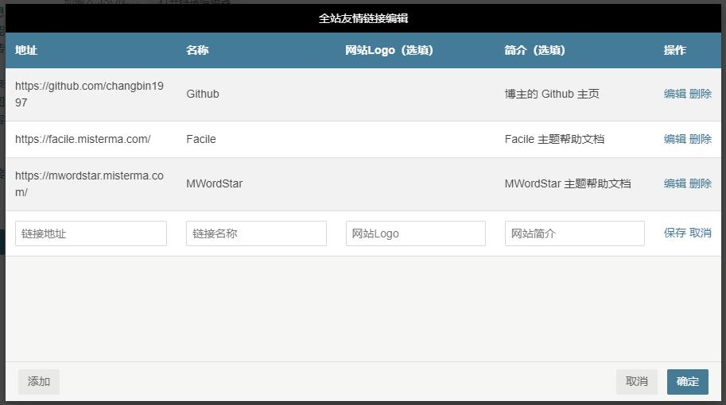

链接编辑器会读取对应的链接配置，你可以很方便的添加、删除、编辑链接，点击 `确定` 后链接编辑器的链接会被添加到对应的输入框。

### 友情链接页面展示设置

友情链接页面除了能展示内页链接外，也能展示首页和全站链接。

下面两个选项可以设置链接页是否展示首页和全站链接：

* 同时在链接页面展示全站链接
* 同时在链接页面展示首页链接

链接效果如下：


## PJAX

PJAX 在页面跳转时只会更新内容部分，不会刷新整个页面，可以实现类似于单页应用的使用体验。

### 启用PJAX

你可以根据需要选择开启或关闭 PJAX 功能。

注意，目前 Typecho 主题的 PJAX 还无法做到和 Typecho 程序完美兼容，如果要启用 PJAX，需要在 Typecho 评论设置中关闭 `开启反垃圾保护` 和 `检查评论来源页 URL 是否与文章链接一致`，否则评论可能无法成功发送！

### PJAX进度条

PJAX 进度条会显示在页面顶部，在 PJAX 页面内容更新时，进度条会显示更新进度，更新完成后进度条会隐藏。禁用 PJAX 进度条不会影响 PJAX 功能。

PJAX 进度条显示的是 PJAX 的几个更新阶段，不会详细到 HTTP 的上传和下载进度。

### PJAX 更新完成后要执行的 JS 代码

你可以在这里填写 JS 代码，PJAX 每次更新完成后都会执行这里的 JS 代码，JS 代码不需要包含 `script` 标签。

## GitHub 项目展示

先在 `GitHub用户名` 表单填写 GitHub用户名，然后在 `撰写` 菜单选择 `创建页面` ，自定义模板选择 `GitHub项目展示` 。

下面是 GitHub 展示页面：

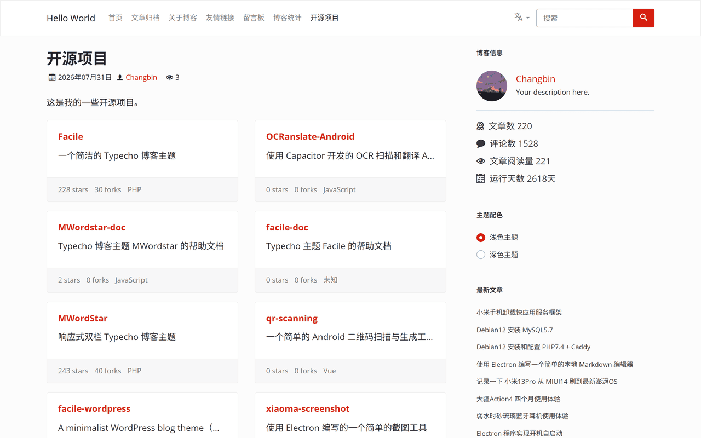

在页面文章编辑框输入的内容也会在展示页输出。

主题使用的是 GitHub REST API，无需登录和受权，无需 API Key，只能显示公开仓库。

API 请求是直接通过访问用户的浏览器发送的，不会通过服务器中转，GitHub REST API 允许跨域请求。

## 开发者

### 自定义 CSS

通过自定义 CSS 您可以很方便的设置页面样式，自定义 CSS 不会影响网站源代码。

### 自定义 head 区域输出的 HTML

自定义 head 区域的 HTML 会在 `</head>` 之前输出。您可以用来定义网站统计的 JS 或者 自定义 JS。

### 自定义 body 底部输出的 HTML

自定义 body 区域的 HTML 会在 </footer> 之后 </body> 之前输出。。您可以用来定义网站统计的 JS 或者 自定义 JS。

## Service Worker

### Service Worker 是什么

Service Worker 是浏览器提供的一种网页缓存技术，开启后主题会把部分 JavaScript 和 CSS 文件缓存到访问者的浏览器中。访问者再次打开您的网站时，这些文件可以直接从浏览器缓存读取，不需要重新下载，可以加快页面加载速度，也能减少服务器的流量消耗。

主题会缓存的文件包括：

1. 打包生成的 JS 文件（文件名类似 `bundle-1788091452.js`）
2. 打包生成的 CSS 文件（文件名类似 `style-1788156990.css`）
3. 代码高亮 JS（`highlight.pack.js`，只有在文章包含代码块时才会加载）

文件名中的数字是打包时生成的时间戳，主题更新打包后数字会变化，Service Worker 会自动删除旧文件的缓存，然后缓存新文件，不需要手动清理。

### 开启前的准备

Service Worker 默认是 `禁用` 的，在开启之前，您需要先手动把 sw.js 文件放到网站的根目录，操作步骤如下：

1. 打开您网站空间（服务器或虚拟主机）中的主题目录，路径一般是 `usr/themes/Facile` 。
2. 进入主题目录中的 `assets/js` 目录，找到 `sw.js` 文件。
3. 把 `sw.js` 复制一份，上传到网站的根目录，也就是 `index.php` 文件所在的目录。

为什么必须放到网站根目录？因为 Service Worker 只能控制 sw.js 所在目录范围内的页面，放在主题目录中是无法拦截网站页面请求的。

Service Worker 只有在 HTTPS 的网站中才能使用，本地搭建的 `localhost` 环境除外。如果您的网站不支持 HTTPS，请保持 `禁用` 。

### 开启和验证

1. 完成 `开启前的准备` 后，在主题设置的 `Service Worker` 选择 `启用`，保存设置。
2. 打开网站首页，按下键盘的 `F12` 键打开浏览器开发者工具，切换到 `Application`（应用程序）选项卡。
3. 在左侧的 `Service Workers` 中可以看到一个状态为 `activated and running` 的 Service Worker，说明注册成功。
4. 在左侧的 `Cache Storage` 中可以看到被缓存的文件列表。

如果没有上传 sw.js 就开启了 Service Worker，网站功能不会受影响，只是无法注册 Service Worker，缓存也不会生效。
