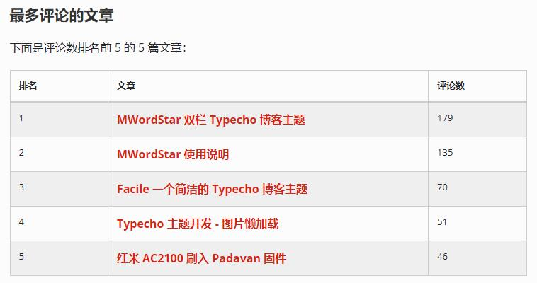

主题包含一个统计页模板，你可以在后台创建页面，页面的自定义模板选择 `网站数据`，标题可以随便写，创建完成后就可以在顶部导航栏访问了。

统计页包含基本的数据统计、分类文章占比图、文章更新日历图、评论动态日历图、阅读量排名前 5 的文章、评论量排名前 5 的文章。

基本数据统计如下：

分类占比统计图如下：

下面是评论动态日历图：

文章动态日历图和评论动态的日历图是差不多的，屏幕尺寸不同显示的月份数量也不同。

下面是文章评论排名表格：

文章阅读量排名表格和评论量排名的表格也是差不多的。

统计页的效果也可以直接访问 [https://www.misterma.com/data.html](https://www.misterma.com/data.html) 查看。